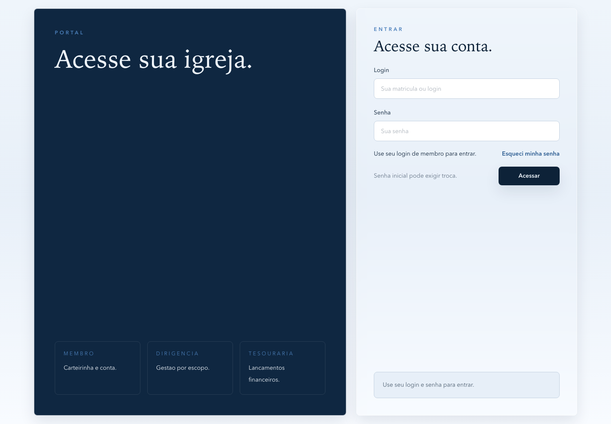
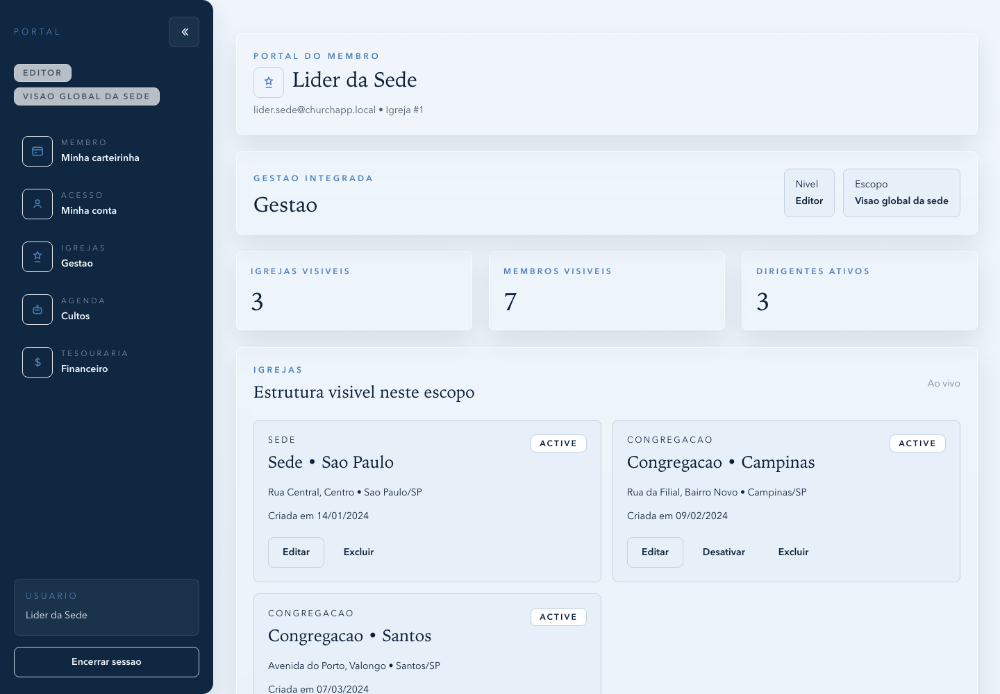
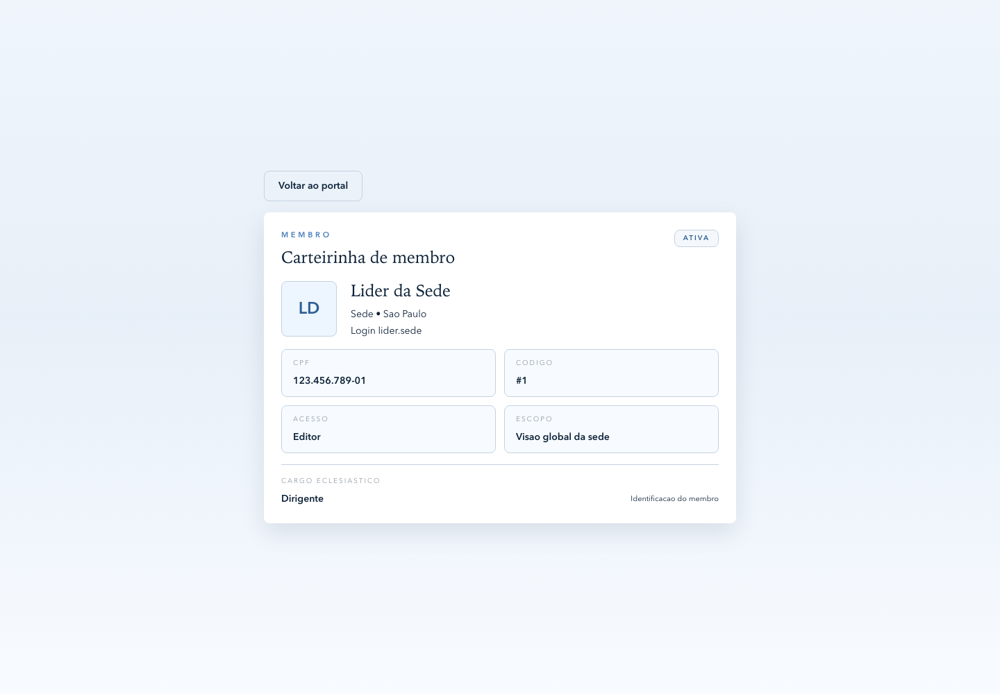

# ChurchAPP

ChurchAPP is a church management application with a separated backend API and web frontend. The project supports headquarters and branch churches, scoped access control, member cards, church governance, services, offerings and financial flows.

```text
ChurchAPP/
├── API/
├── web/
├── assets/
├── scripts/
└── README.md
```

## Screenshots







## What The System Does

- Authenticates members and requires first-login password changes when temporary passwords are used.
- Lets every member access a digital member card and update personal account data.
- Resolves system access from active assignments instead of ecclesiastical role.
- Separates global headquarters scope from local branch scope.
- Supports creation of branch churches with an initial manager in the same workflow.
- Prevents churches from being left without an active manager in normal governance flows.
- Handles members, churches, managers, treasurers, services, recurring services, service offerings, expenses, base offerings, special offerings and tithes.
- Preserves history through logical deletion in the normal application flow.
- Exposes Swagger as part of the official API contract.

## Architecture

- `API/`: Node.js, Express, Prisma and PostgreSQL backend.
- `web/`: Next.js frontend, fully isolated from the API codebase.
- `scripts/`: workspace-level helpers, including the script that starts the complete local stack.
- `assets/screenshots/`: screenshots used by this README.

## Access Model

ChurchAPP authorization does not use the member's ecclesiastical role as a system permission source. Ecclesiastical role remains informational.

System access comes from active assignments:

- Regular members can access their account and member card.
- Managers can view management, services and financial data within their scope.
- Treasurers can operate financial workflows within their scope.
- Headquarters users can receive global scope.
- Branch users remain scoped to their own church.

## Main Flows

- Login and mandatory password change.
- Digital member card in an isolated route.
- Member self-service account updates.
- Headquarters and branch management.
- Structured branch creation with initial manager.
- Immediate manager replacement.
- Responsive sidebar with persisted collapse state.
- Service calendar with recurring weekly services.
- Offerings linked directly to services.
- Financial operations by scope: treasurers, expenses, offerings, special offerings and tithes.

## Local Setup

Requirements:

- Docker
- Docker Compose
- Node.js
- npm

Start the whole application from the repository root:

```bash
./scripts/start-app.sh
```

The script:

- starts PostgreSQL with Docker;
- applies API migrations;
- generates Prisma Client;
- loads demo data;
- starts the API;
- starts the web frontend.

Local URLs:

- Web: `http://localhost:3000`
- API: `http://localhost:3333`
- Swagger: `http://localhost:3333/api-docs/`
- Healthcheck: `http://localhost:3333/health`

## Demo Accounts

```text
lider.sede / Sede123
dirigente.campinas / Campinas123
tesouraria.campinas / Tesouraria123
membro.campinas / CampinasMembro123
membro.temp / 12345678907
```

The `membro.temp` account validates the mandatory password change flow.

## Validation

Backend:

```bash
cd API
npm run build
npm test -- --runInBand
npm run test:e2e
```

Frontend:

```bash
cd web
npm run build
npm run test:e2e
```

The frontend end-to-end suite runs against the real API and PostgreSQL, covering:

- first login and required password change;
- isolated member card route;
- headquarters branch creation;
- branch manager login;
- local treasurer financial operation;
- recurring services and service offerings;
- member self-service profile updates;
- regular member permissions on mobile.

## Project Notes

- The repository was reorganized from an API-only project into a full application workspace.
- The backend continues to live entirely under `API/`.
- The frontend lives entirely under `web/`.
- Web documentation and future UX notes are intentionally kept inside `web/docs/`.
- Refresh token, richer observability and broader production email infrastructure remain future improvements.
